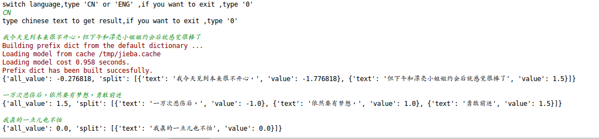
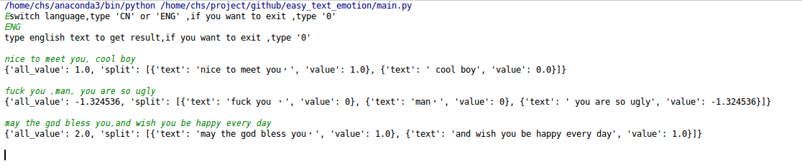

# easy_text_emotion

#introduction

A fast text sentiment analysis program currently supports English and Chinese.

The realization principle is as follows:

1. Loading emotional dictionary (divided into positive word/negative word/degree word/negative word) and segmentation.

2. The emotional value of positive and negative words is accumulated by keyword matching. The default emotional value of positive and negative words is 1/-1 respectively.

3 Retrieving and verifying the semantics of negatives in text and confirming the positive and negative again by multiple checks

4. Controlling the degree of repeated emphasis through a specific interval attenuation function

5. Get an overall emotional value in the range of - 6 to + 6, and the results of piecewise analysis.

一个快速实现文本情感分析的程序，目前支持英文和中文。

实现原理如下:

1 加载情感词典(分为:正向词/负向词/程度词/否定词)，并进行分词分段处理

2 通过关键词匹配进行情感值累加，正负词的情感值默认各为1/-1

3 检索校验文本的否定词语义，进行多重校验再次确认正负性

4 通过特定区间衰减函数控制重复强调出现的程度值

5 得到一个-6 到 +6 区间的整体情感值，以及分段分析结果

#How to run

pip install -r requirements.txt 

python main.py

